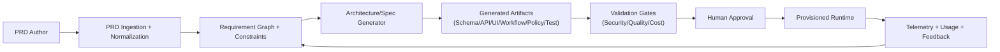
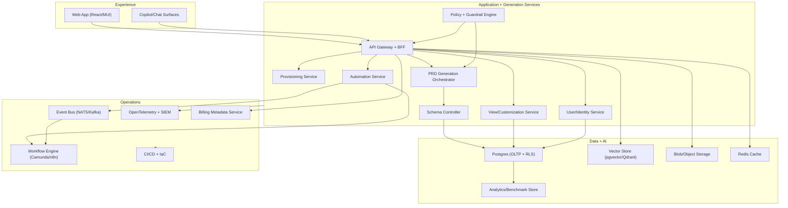

# 01. PRD-Driven Platform Architecture

## 1) Problem Statement

Build an MSP SaaS platform where product requirements become executable platform capabilities through a governed generation pipeline.  
The platform must support:
- Dynamic business data models and UI customization.
- AI-native workflows and natural-language interaction.
- Strong security, compliance, tenancy isolation, and operational observability.

## 2) Product Vision (Condensed)

The platform is an AI-native operating layer for MSPs:
- Customizable data, screens, automation, and integrations.
- Secure sharing and community patterns across MSP ecosystems.
- Built-in AI, search, dashboarding, reporting, and benchmarking.
- Consumption-aware billing and global search (keyword + semantic).

## 3) Architectural Principles

- `P1` Requirements-first: no feature implementation without traceable requirements.
- `P2` Contract-driven: all generated artifacts conform to explicit schemas and policy checks.
- `P3` Tenant-safe by design: authorization and isolation enforced in every tier.
- `P4` Human-in-the-loop: generation can propose and stage, humans approve promote/merge.
- `P5` Evolution over breakage: schema deprecation paths are mandatory, hard deletes are delayed.
- `P6` AI safety: prompt/policy controls, auditability, and deterministic validation gates.

## 4) System Context

Primary actors:
- MSP Admin
- MSP Operator (Dispatcher/NOC/AM roles)
- End Customer User
- Platform Engineer
- AI/Codex Build Agent
- External systems (Microsoft stack, vendor APIs, Jira/Confluence/GitHub)

## 5) Target Logical Architecture

Core platform layers:
- `Experience Layer`: React UI, personalization, views/pods, global search, copilot entry points.
- `Application Services`: Users, provisioning, content packages, customization, automation, reporting.
- `Generation Services`: PRD parser, requirement graph builder, artifact generators, policy engine.
- `Data & AI Layer`: Postgres, pgvector/Qdrant, object/blob store, caching, analytics warehouse.
- `Platform Runtime`: event bus, workflow engine, observability, billing metadata, CI/CD.

## 6) Capability Domains

- `D1` Identity, user lifecycle, and tenancy.
- `D2` Schema and data model management from YAML specs.
- `D3` UI composition (views, pods, layouts, theme/branding).
- `D4` Workflow automation and trigger orchestration.
- `D5` AI services (RAG, copilots, semantic search, embedding control).
- `D6` Integrations (REST, events, MCP adapters, import/export).
- `D7` Reporting, benchmark ontology, and usage billing.
- `D8` DevEx/GenOps (PRD pipeline, tests, governance, deployment).

## 7) Non-Functional Requirements

- `NFR-SEC-01`: Record-level authorization enforced server-side.
- `NFR-TEN-01`: Tenant boundary guarantees for data, vectors, and blobs.
- `NFR-AUD-01`: Immutable audit trail for schema/UI/policy changes.
- `NFR-REL-01`: 99.9% service availability for control plane APIs.
- `NFR-PERF-01`: P95 read API < 300ms for common entity queries.
- `NFR-AI-01`: Prompt and model usage must be logged and attributable.
- `NFR-COST-01`: AI/storage/workflow usage must map to billable events.

## 8) Key Architecture Decisions

- `ADR-001`: Use a `Schema Controller` service instead of schema updates during login.
- `ADR-002`: Separate control-plane metadata from tenant business data.
- `ADR-003`: Use Postgres RLS + tenant-scoped service policies as baseline isolation.
- `ADR-004`: Use event-driven workflow triggers, not direct service chaining for long-running flows.
- `ADR-005`: Require human approval before promoting generated artifacts to production.

## 9) Assumptions To Validate

- Primary cloud target is Azure; local Docker runtime mirrors cloud architecture.
- Python backend + React frontend is acceptable for initial build.
- Workflow engine choice can start with one engine (Camunda or n8n) behind an abstraction.
- Initial vector store can be pgvector, with optional Qdrant for scale isolation.

