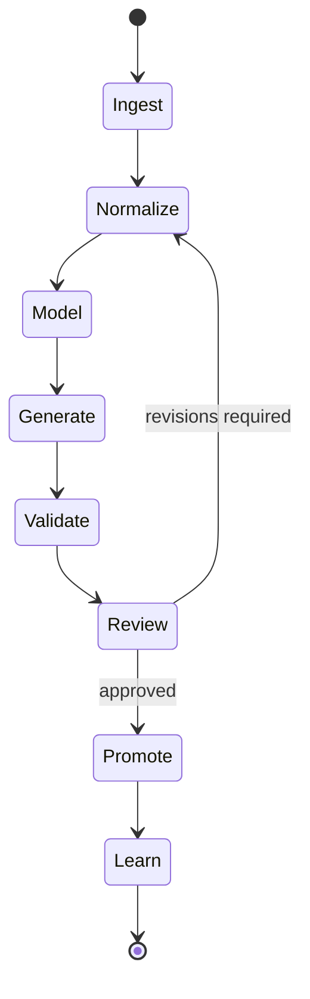

# 02. Generation Pipeline And Governance

## 1) Objective

Define a deterministic pipeline that transforms PRDs into deployable, policy-compliant platform artifacts.

## 2) Pipeline Stages

1. `Ingest`: Pull PRD markdown + referenced constraints + glossary.
2. `Normalize`: Canonicalize requirements into typed requirement statements.
3. `Model`: Build a requirement graph (features, entities, workflows, constraints, NFRs).
4. `Generate`: Produce architecture and implementation artifacts.
5. `Validate`: Run linting, policy checks, tests, and threat/cost checks.
6. `Review`: Human decision (approve/revise/reject).
7. `Promote`: Merge, provision, migrate, deploy.
8. `Learn`: Capture deltas, runtime telemetry, and feedback into future generation context.



## 3) Generated Artifact Set

From each approved PRD, generate:
- `A1` Domain schema manifests (YAML).
- `A2` Database migrations and rollback scripts.
- `A3` API contracts (OpenAPI + event schemas).
- `A4` UI composition manifests (navigation, pods, layouts, visibility rules).
- `A5` Workflow definitions (trigger maps, runbooks/playbooks).
- `A6` Security and policy declarations.
- `A7` Test suites (unit, integration, contract, policy tests).
- `A8` Observability manifests (metrics, logs, traces, alerts).
- `A9` Change documentation (release notes + architecture traceability).

## 4) Requirement Traceability Model

Each requirement has:
- `REQ-ID`
- source document and section
- generated artifacts list
- tests that prove requirement fulfillment
- deployment versions where active

Example mapping table:

| REQ-ID | Requirement | Artifacts | Validation |
|---|---|---|---|
| REQ-DB-001 | Schema defined via YAML | `schema/*.yaml`, migration scripts | schema linter, migration test |
| REQ-AI-003 | Text fields vectorized per policy | vector policy file, embedding job | policy tests, embedding smoke test |
| REQ-UI-005 | 3-level navigation | nav manifest, UI tests | snapshot + role tests |

## 5) Governance Gates

Pre-merge gates:
- schema validity and backward-compatibility checks
- authorization policy checks
- prohibited data/vectorization checks
- prompt and model policy checks
- performance budget checks
- mandatory automated tests pass

Pre-production gates:
- migration dry run on production-like snapshot
- security scan and threat model checklist
- cost impact estimate
- human sign-off from product + platform owner

## 6) Policy Engine

Policy classes:
- `Data Policies`: PII handling, retention, residency, vectorization allow/deny.
- `Security Policies`: auth requirements, MFA, role boundaries, least privilege.
- `Quality Policies`: naming conventions, API standards, test coverage thresholds.
- `Cost Policies`: model selection limits, token budgets, workflow execution budgets.

## 7) Human-In-The-Loop Controls

- Every generated pull request includes:
  - requirement mapping summary
  - architecture delta summary
  - risk assessment
  - rollback steps
- Approvals required before:
  - schema migrations
  - policy changes
  - prompt/policy model changes
  - workflow auto-execution in production

## 8) Repository And Folder Contracts

Recommended implementation repository structure:

```text
/requirements
  /prd
  /nfr
/architecture
  /adr
/contracts
  /schema
  /api
  /ui
  /workflow
/services
/apps
/infra
/tests
/docs
```

## 9) CI/CD Integration (Codex-Compatible)

Required CI stages:
1. `parse-prd`
2. `generate-artifacts`
3. `validate-contracts`
4. `run-tests`
5. `security-and-policy-checks`
6. `build-and-package`
7. `deploy-nonprod`
8. `promote-prod` (manual approval)

## 10) Change Control Rules

- Breaking changes require `major` schema version increment.
- Deleted fields must enter deprecated state for minimum 1 year unless waived.
- Critical policy changes require dual approval.
- Every deployment must carry requirement coverage evidence.

