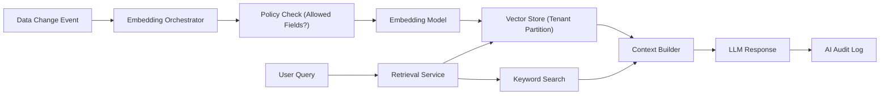

# 03. Data, Schema, And AI Architecture

## 1) Data Architecture Goals

- Support MSP multi-tenancy with strict isolation and auditability.
- Allow customer-specific extensibility without uncontrolled schema drift.
- Enable semantic search and AI over allowed data fields.
- Preserve long-term compatibility through controlled schema evolution.

## 2) Tenant Model

Three logical scopes:
- `Platform` scope: control-plane metadata, package catalog, global ontology.
- `Tenant` scope: MSP-specific business data and customizations.
- `Community` scope: optional shared artifacts with explicit trust policies.

Isolation controls:
- `tenant_id` mandatory on tenant-scoped records.
- Postgres Row-Level Security (RLS) for all tenant data tables.
- Tenant-scoped encryption keys for sensitive fields where required.
- Blob/object access through scoped, short-lived tokens.

## 3) Schema Controller Pattern

The `Schema Controller` is the only component allowed to change database schema.

Responsibilities:
- validate YAML schema manifests
- diff current vs target model
- generate migration plans and rollback plans
- enforce deprecation policy windows
- run preflight tests before applying migrations
- publish schema-change events

Rejected approach:
- schema auto-update during login (too risky and hard to govern).

## 4) Schema Strategy

Baseline pattern:
- `core tables`: stable platform entities (users, orgs, tickets, assets, etc.)
- `extension tables`: tenant-specific custom fields per entity family
- `manifest-driven views`: unified read models combining core + extension data

Recommended structure:
- `entity_core` table (immutable platform baseline columns)
- `entity_ext` table (tenant custom columns in JSONB or generated typed columns)
- optional generated materialized views for performance-sensitive read models

## 5) YAML Schema Contract

```yaml
apiVersion: msp.platform/v1
kind: EntitySchema
metadata:
  name: ticket
  version: 1.4.0
  owner: product-ticketing
spec:
  tenancy:
    mode: tenant_scoped
    tenantKey: tenant_id
  coreFields:
    - name: id
      type: uuid
      required: true
    - name: title
      type: string
      required: true
    - name: status
      type: enum
      values: [new, in_progress, done]
  customFields:
    strategy: extension_table
    tableName: ticket_ext
  deprecation:
    minimumRetentionDays: 365
  ai:
    vectorization:
      allowedFields: [title, description, resolution_notes]
      deniedFields: [customer_ssn, payment_token]
      modelProfile: text-embedding-default
```

## 6) Migration And Deprecation Policy

- Every schema change must produce forward and backward migration artifacts.
- Dropping columns is disallowed until deprecation window is complete.
- Backfill tasks are explicit workflow jobs with progress telemetry.
- Migration plans are dry-run tested on production-like snapshots.

## 7) Blob/Object Strategy

- Blobs are never stored in OLTP records directly.
- File metadata table stores:
  - content hash
  - storage URI
  - owner entity
  - tenant scope
  - retention class
- Duplicate file content de-duplicates by hash.

## 8) AI And Vectorization Design

Core AI components:
- `Embedding Orchestrator`: schedules and updates embeddings.
- `Retrieval Service`: hybrid keyword + vector retrieval.
- `Prompt Policy Service`: persona and data-access-aware context assembly.
- `AI Audit Log`: immutable records of prompts, model decisions, and references.

Vector policies:
- opt-in field-level vectorization only
- denylist and privacy-zone support
- embedding refresh on meaningful data changes only
- tenant-partitioned indexes



## 9) Permissioning For AI Access

- AI retrieval honors the same record-level policies as UI/API access.
- Retrieval pipeline receives security principal + tenant + persona context.
- Prompt context excludes fields marked restricted in schema policy.
- Sensitive outputs are tagged for downstream redaction/logging controls.

## 10) Benchmarking And Ontology

To support cross-tenant benchmarking:
- maintain a global taxonomy registry (`status`, `priority`, `industry`, etc.)
- map tenant custom labels to canonical classes
- keep mapping provenance and confidence scores
- use anonymized aggregates for benchmark reporting

## 11) Key Risks And Mitigations

- Risk: uncontrolled schema sprawl.
  - Mitigation: schema controller validations + versioning + approval gates.
- Risk: vector cost explosion.
  - Mitigation: field-level policies, refresh throttling, semantic caching.
- Risk: tenant leakage in AI context.
  - Mitigation: policy-bound retrieval + audited context assembly.

