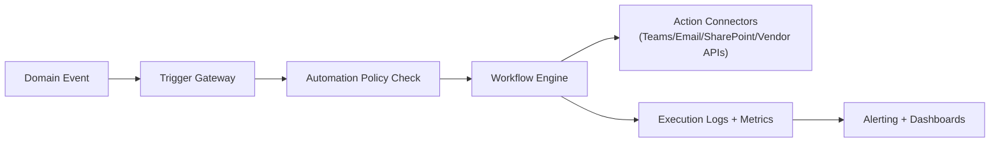

# 04. Application, Security, UI, Automation, And Ops

## 1) Application Services

Core services:
- `Identity Service`: user lifecycle, MFA, session/token management.
- `Provisioning Service`: tenant bootstrap, first-user ownership, base package install.
- `Customization Service`: navigation, pods, screen layouts, branding, view sharing.
- `Automation Service`: trigger/event routing and workflow execution integration.
- `Integration Service`: REST, webhook, MCP connector orchestration.
- `Search Service`: global keyword + semantic search orchestration.
- `Billing Metadata Service`: usage event metering for compute/storage/tokens/workflows.

## 2) Identity And Access Design

Authentication:
- secure password hashing + optional external IdP
- MFA required for privileged roles
- email and phone verification

Authorization:
- role-based baseline (Owner/Admin/Operator/Viewer/etc.)
- attribute and record-level policies for fine-grained filtering
- one special `owner` user per tenant, transferable under strict workflow

## 3) Security Architecture

Controls:
- defense-in-depth API gateway checks
- least-privilege service identities
- secrets in managed vault
- encryption in transit and at rest
- tenant-aware audit trails
- secure coding and dependency scanning in CI

Compliance readiness targets:
- SOC 2 control mapping
- GDPR/DPA-friendly data handling
- regional controls for EU/AU/NA deployment profiles

## 4) UI Architecture (Based On Requirements)

Navigation and shell:
- left navigation with 3 levels, collapsible
- top bar with logo, search, create, notifications, AI, help, community, user menu
- main content pane with breadcrumbs

Customization:
- theme/branding controls (primary, secondary, foreground, link)
- dark and light mode
- tenant default view + personal overrides
- role/context-aware component visibility

Pods and layouts:
- data-bound controls (textbox, textarea, number, decimal, currency, dropdown, checkbox)
- 16-column responsive layout model
- shareable view states and deep links
- sandboxed custom component extension model

## 5) UI Manifest Pattern

```yaml
apiVersion: msp.platform/v1
kind: ViewManifest
metadata:
  name: dispatcher-ticket-board
  version: 1.0.0
spec:
  nav:
    section: operations
    path: [service, tickets, board]
  shell:
    topBar:
      show: [logo, search, create, notifications, ai, help, community, user]
  layout:
    columns: 16
    components:
      - id: triageQueue
        type: data_grid
        span: 10
        visibility:
          roles: [dispatcher, admin]
      - id: slaPanel
        type: kpi_card_group
        span: 6
  variables:
    - name: date_range
      type: daterange
    - name: status
      type: enum
```

## 6) Automation Architecture

Pattern:
- services emit domain events
- trigger gateway normalizes events
- policy engine validates automation eligibility
- workflow engine executes runbook/playbook
- outcomes and failures are observable and retryable



## 7) Deployment Architecture

Local developer runtime:
- Docker Compose baseline
- Python backend, React frontend, Postgres, Redis, optional local vector service

Cloud target (Azure-first):
- App hosting for APIs/UI
- Azure Database for PostgreSQL
- Blob storage for objects
- managed identity/secret services
- telemetry pipeline to SIEM

Environments:
- `dev` -> `test` -> `staging` -> `prod`
- immutable build artifacts promoted across environments

## 8) Observability And Reliability

Operational baseline:
- OpenTelemetry traces + metrics + structured logs
- SLOs per critical API and workflow
- synthetic checks for auth, search, workflow, and provisioning
- incident runbooks and on-call ownership

Must-have dashboards:
- API latency/error rates
- workflow success/retry/dead-letter
- vector index freshness and retrieval latency
- tenant-level usage and cost visibility

## 9) Consumption-Based Billing Telemetry

Metered units:
- model tokens (input/output)
- workflow executions and runtime
- API calls/compute tiers
- storage size and egress
- vector storage/query usage

Billing principles:
- explainability of charges by feature/workflow
- near real-time usage visibility
- anomaly detection for cost spikes

