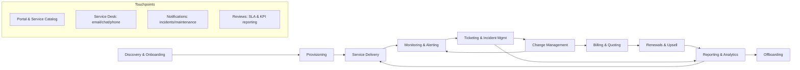
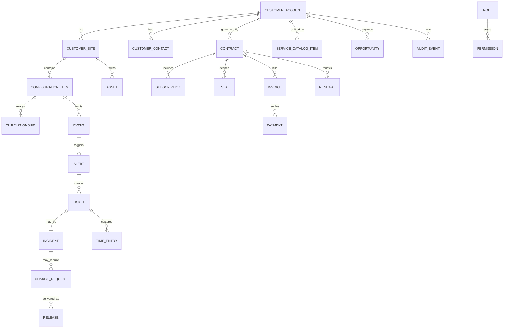

# MSP Customer Lifecycle Management Software Requirements

## Executive summary

Managed Service Providers (MSPs) manage *two intertwined lifecycles* through software: (1) the **customer relationship lifecycle** (sales → onboarding → renewal/offboarding) and (2) the **service lifecycle** (service design → delivery → monitoring → incident/change → continual improvement). A rigorous requirements set for “specialty MSP software” therefore needs a **customer-centered system of record**, strong **service management controls**, and **multi-tenant-by-design** security and data architecture. ITIL’s Service Value System (SVS) and Service Value Chain provide a widely used reference model for organizing these value streams and continual improvement loops. citeturn8search12turn0search0

Across the full lifecycle, the most important outcomes are: **faster onboarding**, **higher SLA attainment**, **lower MTTR/MTTD**, **higher utilization efficiency**, **accurate recurring billing**, **higher renewal and expansion rates**, and **audit-ready security/privacy controls**. These outcomes map directly to ITIL practices such as Incident Management (restore service quickly), Change Management (plan/approve/test/review changes), Event Management (detect/manage events early), Service Catalog (clarify services/costs/SLAs), CMDB (track configuration items and relationships), and Service Continuity Management (restore critical services quickly during major disruptions). citeturn6search0turn6search1turn6search3turn10search0turn10search1turn11search1

From a procurement standpoint, software must be evaluated as a **platform + ecosystem** rather than isolated modules, because core workflows require continuous integrations between CRM/quoting, PSA/service desk, RMM/monitoring, CMDB/asset inventory, billing/subscriptions, and reporting. RMM and PSA are often described as complementary: RMM generates device/service health telemetry and alerts, while PSA manages service workflows (tickets, time, contracts, billing, reporting) that turn technical work into customer outcomes and revenue capture. citeturn3search0

Security and compliance requirements should be grounded in: **SOC 2 Trust Services Criteria** (security, availability, processing integrity, confidentiality, privacy), **GDPR** principles (lawfulness, purpose limitation, data minimization, storage limitation, integrity/confidentiality, accountability) and rights (access, erasure, portability), and well-established technical guidance for identity, logging, and recovery (e.g., NIST digital identity and contingency planning). citeturn0search1turn0search5turn7search11turn7search0turn7search1turn7search2turn4search0turn1search0

Unspecified by the request (and therefore must be defined during procurement) include: exact **SLA targets**, **RTO/RPO**, **data residency**, required **industry-specific regulations** (e.g., HIPAA, PCI DSS), and scale assumptions (tenants/endpoints/tickets/month). These are treated as **unspecified** unless explicitly stated.

## Lifecycle model and customer touchpoints

A customer lifecycle lens for MSP software aligns well with ITIL’s SVS framing for value creation (linking guiding principles, governance, practices, a service value chain, and continual improvement). citeturn8search12turn8search5 In practice, MSP lifecycle stages provided in the prompt can be treated as a value stream that continuously loops through improvement (ITIL’s focus on continual improvement and value streams). citeturn8search12turn8search5

**Customer touchpoints** are the observable “interfaces” where the customer (client org + its end users + customer stakeholders) experiences service. Touchpoints should be intentionally designed and measured because ITIL emphasizes aligning service management to stakeholder value and measuring outcomes, not just outputs. citeturn8search12turn6search2

**Primary touchpoint channels across all stages (typical for MSPs; exact mix is unspecified):**
- Customer portal and service catalog (self-service requests, status, approvals, knowledge base). citeturn10search0turn5search7turn5search4
- Email-to-ticket, chat, phone (service desk intake and customer communications). citeturn6search0turn5search4
- Proactive notifications (maintenance windows, incident updates, security advisories) driven by monitoring/event workflows. citeturn6search3turn6search0
- Scheduled business reviews / renewal conversations (performance reports, roadmap, contract updates). (Specific cadence is **unspecified**; KPI emphasis derives from SLA/KPI alignment practices.) citeturn6search2turn11search5

**Reference lifecycle map (customer-centered value stream)**



This value stream approach mirrors ITIL’s emphasis that services are planned, delivered, assessed, and improved as interconnected activities rather than siloed processes. citeturn8search12turn0search0

## Stage-by-stage requirements

Below, each lifecycle stage includes: functional requirements (features/workflows/data models), integrations/APIs, data flows, roles/permissions, SLAs/automation, KPIs/outcomes, security/privacy/compliance, scalability/performance, backup/DR, multi-tenant considerations, customization/localization, UI/UX, training/support, and testing/QA. Where values would depend on the MSP’s contracts or environment, they are explicitly marked **unspecified**.

### Discovery and onboarding

| Category | Requirements and outcomes |
|---|---|
| Customer touchpoints | Sales consults and discovery workshops; onboarding kickoff; customer-facing onboarding plan; customer portal enablement (if offered). (Exact channels are **unspecified**.) |
| Functional requirements (features/workflows/data models) | CRM-level customer record and contact hierarchy; structured discovery intake (sites, users, assets, network diagrams, cloud tenants); onboarding project templates (tasks, milestones, dependencies); service catalog selection and contract baseline creation; document capture and approvals. Service catalog concepts support clarity on services, costs, SLAs, and request paths. citeturn10search0turn10search3 |
| Integrations/APIs needed | Identity and directory sources for customer org (commonly via federated identity; exact IdP is **unspecified**); import connectors for asset discovery; e-signature/contract systems (unspecified); email/calendar integrations (unspecified). Standards commonly used include OAuth 2.0 and OpenID Connect for delegated authorization and authentication. citeturn0search3turn1search2 |
| Data flows | Lead/opportunity → quote → contract/SLA baseline → onboarding project → initial CMDB/asset inventory → monitoring enrollment. CMDB supports capturing configuration items (CIs) and relationships/dependencies. citeturn10search1turn10search4 |
| User roles/permissions | Sales role (CRM + quoting); onboarding coordinator (project plans); security engineer (credential/secrets handling); customer admin (approve access/service scope). Role-based access helps ensure customers only see relevant services and data. citeturn10search3 |
| SLAs/automation | Onboarding SLAs (e.g., onboarding completion time) are **unspecified**; automation should create standard tasks, request missing data, and open provisioning tickets from onboarding milestones. |
| KPIs/outcomes | Time-to-onboard (**unspecified target**); “time to first value” and early onboarding friction signals; successful activation of monitoring and portal access; reduction in onboarding-related ticket spikes (targets **unspecified**). |
| Security/privacy/compliance requirements | Data minimization and purpose limitation for onboarding data collection; ensure processing is lawful and transparent; define retention and access controls for sensitive discovery artifacts. citeturn7search11turn0search6 |
| Scalability/performance | Must support parallel onboardings (count **unspecified**) without workflow bottlenecks; bulk import for assets/users must be performant to avoid multi-day data entry. |
| Backup/DR | Onboarding artifacts must be captured in platform backup scope; recovery objectives (RTO/RPO) are **unspecified** and should be set using a formal contingency planning approach. citeturn1search0 |
| Multi-tenant considerations | Tenant isolation and prevention of cross-tenant data leakage are critical in SaaS MSP platforms; minimize risk of isolation escape and IDOR-style cross-tenant access. citeturn3search1turn3search9 |
| Customization/localization | Custom onboarding templates by industry/customer tier; localized customer communications and portal language support (languages **unspecified**). |
| UI/UX needs | Guided data collection; progress visibility for both MSP and customer; low-training portal UX for service requests and visibility. citeturn10search3turn5search7 |
| Training/support | Role-based onboarding playbooks; knowledge base for onboarding steps; support for staff training is a recurring ITIL best practice theme (exact training program **unspecified**). citeturn6search0turn11search2 |
| Testing/QA | Template testing for onboarding workflows; import validation tests; permission tests ensuring a customer cannot view another tenant’s onboarding artifacts. citeturn3search9 |

### Provisioning

| Category | Requirements and outcomes |
|---|---|
| Customer touchpoints | Provisioning confirmations; access grant notifications; customer approvals for privileged access or new services (mechanism **unspecified**). |
| Functional requirements (features/workflows/data models) | Provisioning as structured service requests/projects: account creation, endpoint agent rollout, baseline policies, backup enrollment, monitoring thresholds; tracking of provisioning status per site and per service offering; link provisioning tasks to the CMDB so changes become traceable configuration history. citeturn10search1turn6search1 |
| Integrations/APIs needed | Directory and identity integration for automated provisioning; standardized identity provisioning can use SCIM for user lifecycle operations in multi-domain identity scenarios. citeturn1search11 |
| Data flows | Service catalog request → approvals → provisioning runbooks → asset/CI updates in CMDB → monitoring enrollment → confirmation to customer portal. Service requests are standardized and frequently automated when pre-approved. citeturn5search4turn5search7 |
| User roles/permissions | Provisioning technician; security approver; customer approver. Segregation-of-duties is recommended for privileged operations (exact SoD policy **unspecified**). |
| SLAs/automation | Automated provisioning pipelines; pre-approved standard service requests; SLA targets **unspecified** but should be measurable and visible. citeturn6search2turn5search4 |
| KPIs/outcomes | Provisioning lead time; provisioning success rate; percent automated vs manual; “rework rate” due to missing prerequisites (targets **unspecified**). |
| Security/privacy/compliance requirements | Strong authentication guidance for admin workflows and enrollment processes aligns to digital identity guidance (assurance approach depends on risk). citeturn4search0 |
| Scalability/performance | Massive-scale agent deployment and configuration updates must handle bursts (endpoints **unspecified**) without throttling failures; idempotent provisioning to support retries. |
| Backup/DR | Provisioning state and configuration must be recoverable; configuration baseline drift should be reconstructible from CMDB + logs. citeturn10search1turn1search1 |
| Multi-tenant considerations | Provisioning automation must enforce tenant-bound identifiers; prevent “wrong-tenant” provisioning actions by design. citeturn3search9 |
| Customization/localization | Customer-tier-based policies; site templates; localized customer notifications (language support **unspecified**). |
| UI/UX needs | Technician-friendly runbooks; clear errors and rollback guidance; customer-facing status and approvals in portal. citeturn10search3turn5search4 |
| Training/support | Runbook documentation and change/release training; release management emphasizes planned, tested deployments with minimal disruption. citeturn5search12 |
| Testing/QA | Automated tests for provisioning scripts; staging tenant for safe validation; permission tests for tenant boundaries. citeturn3search9 |

### Service delivery

| Category | Requirements and outcomes |
|---|---|
| Customer touchpoints | Service desk interactions; customer communications; service catalog usage; scheduled service reviews (cadence **unspecified**). citeturn5search4turn10search0 |
| Functional requirements (features/workflows/data models) | PSA-grade workflows: ticket queues, dispatch, time entry, contract entitlements, agreements, SLAs, knowledge base, customer communications, approvals, and standardized service request handling distinct from incidents. citeturn6search4turn3search0 |
| Integrations/APIs needed | Email ingestion and notifications (unspecified); collaboration/chat integration (unspecified); RMM alert integration into ticketing; CMDB lookup from tickets. CMDB captures CI attributes and relationships to support investigation and impact analysis. citeturn10search1turn10search2 |
| Data flows | Customer request → service request workflow (often low-risk and automatable) or incident workflow (restore service) → updates to customer → resolution → time/parts capture → billing signals. Distinction between incident and service request is emphasized in ITIL guidance. citeturn6search4turn5search4 |
| User roles/permissions | Service desk agent; dispatcher; escalation tiers; account manager; customer end user vs customer admin visibility. |
| SLAs/automation | SLA measurement should be explicit and customer-aligned; ITIL guidance emphasizes negotiated SLAs with measurable KPI targets. citeturn6search2 |
| KPIs/outcomes | SLA compliance; first response time; first contact resolution; customer satisfaction proxy metrics; service request cycle time (targets **unspecified**). citeturn6search2turn5search4 |
| Security/privacy/compliance requirements | Access control and auditability for customer data; SOC 2-aligned controls for security and availability are commonly sought assurance signals for service organizations. citeturn0search1turn0search5 |
| Scalability/performance | Must handle peak ticket volumes during major incidents; queue performance and search responsiveness. |
| Backup/DR | Ticket history, communications, and knowledge base must be included in backups; disaster recovery planning should follow structured contingency planning aligned to business impact. citeturn1search0turn6search0 |
| Multi-tenant considerations | Ensure customer portal isolates visibility by tenant; prevent cross-tenant search leakage; enforce tenant-scoped ticket IDs. citeturn3search9 |
| Customization/localization | Custom ticket forms and categories by customer; localized templates for customer communications (unspecified languages). |
| UI/UX needs | Fast triage UX; clear SLA clocks; accessible knowledge base; customer portal transparency improves trust and efficiency. citeturn10search0turn5search4 |
| Training/support | Ongoing training for categorization, SLA discipline, and post-incident reviews; ITIL incident management best practices emphasize staff training and PIRs. citeturn6search0 |
| Testing/QA | Regression testing for workflow/routing changes; load testing for major incident scenarios; role-based portal testing. citeturn6search0turn3search9 |

### Monitoring and alerting

| Category | Requirements and outcomes |
|---|---|
| Customer touchpoints | Proactive notifications; status dashboards; maintenance advisories; customer-facing incident communications when alerts become incidents. Event management aims to identify issues early and trigger responses before disruption. citeturn6search3turn6search0 |
| Functional requirements (features/workflows/data models) | RMM-grade telemetry ingestion; event/alert normalization; thresholds, anomaly rules; alert correlation and noise suppression; mapping alerts to CIs/services; automated remediation runbooks; creation of tickets/incidents from actionable alerts. ITIL describes monitoring and event management as observing services/components and responding to changes of state. citeturn5search0turn6search3 |
| Integrations/APIs needed | Agent-based and agentless integrations (unspecified set); streaming/event integration into ticketing; CMDB synchronization. |
| Data flows | Telemetry/events → correlation/enrichment with CMDB → routed alerts → (a) auto-remediation or (b) ticket creation → customer comms if needed. CMDB relationship mapping supports impact analysis. citeturn10search1turn6search3 |
| User roles/permissions | NOC engineer; automation engineer; service owner; customer read-only visibility (if portal includes monitoring). |
| SLAs/automation | SLO/SLA definitions are **unspecified**; automation should support rapid detection and prevent alert storms; event management best practices emphasize timely responses. citeturn6search3turn6search2 |
| KPIs/outcomes | Mean time to detect (MTTD); alert-to-incident conversion rate; false positive rate; auto-remediation success rate; reduction in downtime (targets **unspecified**). |
| Security/privacy/compliance requirements | Secure telemetry channels; least privilege for agents; audit logs for monitoring configuration changes (security control families include audit/accountability and access control). citeturn1search1turn1search4 |
| Scalability/performance | High-volume ingestion and near real-time routing; resource contention must not impact availability in multitenant environments. citeturn3search9turn3search5 |
| Backup/DR | Retention policies for telemetry are **unspecified**; critical configuration (rules, thresholds) must be recoverable; DR plans should align to contingency planning practices. citeturn1search0turn5search0 |
| Multi-tenant considerations | Strict tenant isolation for agents and telemetry; avoid cross-tenant correlation mistakes; multi-tenant security risks are explicitly documented by OWASP. citeturn3search9turn3search1 |
| Customization/localization | Customer-specific thresholds and maintenance windows; customer-specific notification branding; localization **unspecified**. |
| UI/UX needs | Service health dashboards; alert triage console; clear mapping from alert → CI → customer impact. citeturn10search1turn6search3 |
| Training/support | Runbook training; escalation playbooks; continual improvement loop for alert tuning (ITIL continual improvement is part of SVS). citeturn8search12turn6search3 |
| Testing/QA | Synthetic monitoring validation; correlation rule testing; “chaos”/failure-mode tests are **unspecified** but recommended for resilience; tenant boundary tests. citeturn3search9 |

### Ticketing and incident management

| Category | Requirements and outcomes |
|---|---|
| Customer touchpoints | Ticket submission and status; major incident comms; PIR summaries (format **unspecified**). ITIL incident management aims to restore normal service quickly and minimize negative impact. citeturn6search0turn2search0 |
| Functional requirements (features/workflows/data models) | Incident lifecycle: intake, categorization, prioritization, assignment, escalation (functional/hierarchical), communications, resolution, closure, PIR; major incident management; linkage to CIs/services; known errors and knowledge base. citeturn6search0turn10search1 |
| Integrations/APIs needed | Monitoring → incident linking; chat/voice/email; status page (unspecified); CMDB queries; reporting/export APIs. |
| Data flows | Alert/event → incident ticket → escalation → fix/workaround → validation → closure → metrics capture → trend analysis. ITIL best practices emphasize trend analysis and PIRs. citeturn6search0turn6search3 |
| User roles/permissions | Service desk; incident manager; major incident team; customer communications lead; customer stakeholders visibility based on role. citeturn6search0 |
| SLAs/automation | SLA clocks for response/resolution by priority; automated routing; suggested knowledge articles; customer updates at set intervals (intervals **unspecified**). SLA/KPI targets should be measurable and customer-aligned. citeturn6search2turn6search0 |
| KPIs/outcomes | MTTR; SLA compliance; reopen rate; major incident frequency; customer satisfaction; incident volume by service (targets **unspecified**). citeturn6search0turn6search2 |
| Security/privacy/compliance requirements | Audit trails for incident actions; breach detection/notification workflows may be needed (GDPR breach notification has a 72-hour requirement for controllers where feasible). citeturn4search2 |
| Scalability/performance | Must handle major-incident spikes in tickets and comms; search and reporting performance. |
| Backup/DR | Incident history and communications are required records for learning and audit; recovery plans should support restoring these systems quickly in disruptions. citeturn11search1turn1search0 |
| Multi-tenant considerations | Tenant-scoped incidents; prevent cross-tenant comms errors; isolate attachments and logs by tenant. citeturn3search9 |
| Customization/localization | Priority matrices per customer; localized customer-facing templates. |
| UI/UX needs | Fast triage UI; major incident “war room” view; customer-friendly status updates. citeturn6search0 |
| Training/support | Regular staff training and PIR discipline; ITIL incident management guidance explicitly calls out training and post-incident reviews. citeturn6search0 |
| Testing/QA | Workflow regression tests; major-incident simulations; permissions testing; reporting accuracy validation. citeturn6search0turn3search9 |

### Change management

| Category | Requirements and outcomes |
|---|---|
| Customer touchpoints | Change approvals (for customer-impacting changes); maintenance notices; rollback communications; change review outcomes (format **unspecified**). |
| Functional requirements (features/workflows/data models) | Change request lifecycle: classify (standard/normal/emergency), risk/impact assessment, approvals (e.g., CAB concept), scheduling, implementation with rollback plans, post-implementation review; link changes to CIs and incidents. ITIL change management emphasizes planning, approving, testing, reviewing to reduce downtime and improve quality. citeturn6search1turn2search13 |
| Integrations/APIs needed | CI/CD (unspecified); infrastructure-as-code (unspecified); CMDB updates; calendar/scheduler; customer notification channels. citeturn2search13 |
| Data flows | Change request → risk/impact analysis using CMDB dependencies → approvals → scheduled window → deployment → CMDB/config update → monitoring verification → closure. citeturn10search1turn6search1 |
| User roles/permissions | Change manager; implementer; approver/CAB; customer approver for scoped changes (when contract requires; **unspecified**). citeturn6search1 |
| SLAs/automation | Change lead times (unspecified); automation for standard changes; enforcement of change windows to minimize disruption. citeturn6search1 |
| KPIs/outcomes | Change success rate; change failure rate/rollback rate; emergency change count; approval cycle time; change-related incident rate. ITIL change management guidance explicitly highlights tracking KPIs. citeturn6search1 |
| Security/privacy/compliance requirements | Audit trails and documentation for compliance; least-privilege change execution; enforce segregation-of-duties (policy **unspecified**). citeturn6search1turn1search1 |
| Scalability/performance | Scheduling and approvals at scale; avoid bottlenecks with standardized low-risk changes. citeturn6search1 |
| Backup/DR | Rollback planning is explicitly referenced as part of safe change implementation; DR plans should coordinate with continuity planning. citeturn6search1turn1search0 |
| Multi-tenant considerations | Prevent applying a change in the wrong tenant/site; enforce tenant-scoped automation credentials. citeturn3search9 |
| Customization/localization | Change types and risk scoring per customer; localized customer notifications. |
| UI/UX needs | Change calendar, dependency visualization, approval UX, and clear rollback instructions. CMDB relationship mapping supports impact analysis. citeturn10search1turn6search1 |
| Training/support | Change discipline training; release management concepts emphasize planned, tested releases to minimize disruption. citeturn5search12 |
| Testing/QA | Pre-deploy validation, staging testing, and post-deploy verification; service validation/testing is an ITIL practice area. citeturn8search5turn5search12 |

### Billing and quoting

| Category | Requirements and outcomes |
|---|---|
| Customer touchpoints | Quotes/proposals; invoice delivery; billing dispute resolution; plan change confirmations (channels **unspecified**). |
| Functional requirements (features/workflows/data models) | Quote-to-cash linking: quote items → contract/subscription → entitlement → invoicing; usage/seat/device counts; proration; tax handling (jurisdictions **unspecified**); revenue recognition rules are **unspecified**; PSA capabilities typically include billing/invoicing and CRM/time tracking in professional services contexts. citeturn9search0turn3search0 |
| Integrations/APIs needed | Accounting/ERP (unspecified); payment providers (unspecified); procurement/distributor feeds (unspecified); product/service catalog alignment with billing SKUs. |
| Data flows | Quote → approval/signature → contract activation → recurring invoice generation → payment → reconciliation → revenue/AR reporting. PSA software markets highlight billing and invoicing as core capabilities. citeturn9search0 |
| User roles/permissions | Sales/quoting; finance/billing admin; service manager (entitlements); customer billing contact and approver. |
| SLAs/automation | Automated recurring billing and proration; dispute SLAs **unspecified**; billing cycles **unspecified**. Vendor guidance for MSPs notes PSA should support multiple MSP pricing models (value-based, device/endpoint-based, user-based, project-based). citeturn9search6 |
| KPIs/outcomes | Billing accuracy; invoice cycle time; DSO (days sales outstanding) (targets **unspecified**); margin by customer/service; leakage rate (unbilled work). |
| Security/privacy/compliance requirements | Protect billing PII; GDPR requires lawful processing and storage limitation; ensure access controls and audit trails. citeturn7search11turn10search1 |
| Scalability/performance | High-volume invoice generation; pricing catalog management at scale; API throughput for usage ingestion. |
| Backup/DR | Financial records retention is **unspecified** and jurisdiction-dependent; backups must support restoration with integrity. citeturn1search0 |
| Multi-tenant considerations | Tenant-specific price books and taxes; prevent cross-tenant invoice data leakage. citeturn3search9 |
| Customization/localization | Multi-currency and invoice localization (currencies/languages **unspecified**); customer-specific contract terms. |
| UI/UX needs | Quote builder; contract clarity; billing dispute workflow UI; customer billing portal is **optional/unspecified**. |
| Training/support | Billing training by role; audit readiness processes (documentation, controls) align with SOC 2 “controls over systems.” citeturn0search1turn0search5 |
| Testing/QA | Pricing rule tests; proration correctness tests; invoice preview QA; integration contract tests with accounting APIs. |

### Renewals and upsell

| Category | Requirements and outcomes |
|---|---|
| Customer touchpoints | Renewal notices; QBRs/service reviews; expansion proposals; customer success communications (cadence **unspecified**). |
| Functional requirements (features/workflows/data models) | Renewal pipeline, contract term tracking, co-terming, automated renewal reminders, expansion opportunity triggers from telemetry and service consumption, customer health scoring (model **unspecified**), playbooks. Renewal motions depend on clear SLA/KPI reporting and service value transparency. citeturn6search2turn11search5 |
| Integrations/APIs needed | CRM ↔ billing ↔ PSA; product usage/monitoring data feeds; survey tools (unspecified). |
| Data flows | Service performance + consumption signals → health score → renewal risk alerts → account manager tasks → quote/contract changes. ITIL emphasizes metrics and continual improvement; SLA targets should be measurable and reviewed. citeturn6search2turn11search5turn8search12 |
| User roles/permissions | Account manager/customer success; sales; finance; service delivery lead; customer stakeholders (read reports). |
| SLAs/automation | Automated renewal reminders; automated “expansion opportunities” from threshold signals; renewal response SLAs **unspecified**. |
| KPIs/outcomes | Gross churn, net revenue retention, renewal rate, expansion rate, forecast accuracy (targets **unspecified**). |
| Security/privacy/compliance requirements | Ensure lawful use of customer data for analytics/upsell; GDPR purpose limitation and transparency apply. citeturn7search11turn0search6 |
| Scalability/performance | Scaling account intelligence across many tenants without manual effort; compute cost controls. |
| Backup/DR | Contract/renewal history included in backups; DR requirements **unspecified**. citeturn1search0 |
| Multi-tenant considerations | Avoid cross-tenant benchmarking leakage unless explicitly permitted (permission model **unspecified**). citeturn3search9 |
| Customization/localization | Renewal cycles by contract type; localized renewal comms. |
| UI/UX needs | Renewal dashboards; risk indicators; quick conversion from insight → quote. |
| Training/support | Playbook coaching; consistent process to reduce variability and improve visibility (general best-practice rationale aligned with value stream discipline). citeturn8search12 |
| Testing/QA | Renewal trigger tests; forecast pipeline QA; permissions and data aggregation boundary tests. citeturn3search9 |

### Reporting and analytics

| Category | Requirements and outcomes |
|---|---|
| Customer touchpoints | SLA reports; service reviews; executive dashboards; audit exports (format/cadence **unspecified**). ITIL emphasizes KPIs and measurable targets tied to SLAs. citeturn6search2turn11search5 |
| Functional requirements (features/workflows/data models) | Unified reporting across CRM/PSA/RMM/CMDB/billing; KPI library; drill-down by customer/site/service; trend analysis; customer-facing reports; audit-ready exports. ITIL notes performance analytics and measurement/reporting tools support service quality evaluation. citeturn11search5turn8search12 |
| Integrations/APIs needed | Data warehouse/lake (optional/unspecified); BI tools (unspecified); APIs for exporting metrics; event stream consumption. |
| Data flows | Operational data → curated metrics model → dashboards → customer reports; feedback loop into improvement planning (SVS continual improvement). citeturn8search12turn11search5 |
| User roles/permissions | Executives (read-only); operations managers; finance analysts; customers (limited dashboards). Role-based access control keeps users’ visibility scoped. citeturn10search3 |
| SLAs/automation | Automated report generation; anomaly alerts for SLA breaches; report freshness SLOs **unspecified**. citeturn6search2 |
| KPIs/outcomes | SLA attainment; MTTR/MTTD; ticket volume trends; utilization; profitability; customer satisfaction proxies; automation rate (targets **unspecified**). citeturn6search2turn6search0 |
| Security/privacy/compliance requirements | GDPR data minimization and storage limitation in analytics; define data retention; support data subject rights (access, erasure, portability). citeturn7search11turn7search0turn7search1turn7search2 |
| Scalability/performance | Support large joins/search across CIs/tickets/telemetry; performance isolation between tenants. citeturn3search9 |
| Backup/DR | BI configurations and report definitions included in backups; analytics warehouse DR is **unspecified**. citeturn1search0 |
| Multi-tenant considerations | Tenant-scoped metrics; secure aggregation; avoid cross-tenant inference risks. citeturn3search9 |
| Customization/localization | Per-customer KPIs; localized report formats; time zones and business hours per customer. |
| UI/UX needs | Executive-friendly dashboards; “explainability” from KPI → underlying tickets/alerts; portal embedding optional. |
| Training/support | KPI literacy; consistency in measurement definitions (ITIL links SLA negotiation to measurable KPI targets). citeturn6search2 |
| Testing/QA | Metric correctness tests; reconciliation tests (billing vs time entries); permission tests; performance regression tests. |

### Offboarding

| Category | Requirements and outcomes |
|---|---|
| Customer touchpoints | Offboarding plan and timeline; access removals; data export delivery; confirmation of destruction/return of data (exact deliverables **unspecified**). |
| Functional requirements (features/workflows/data models) | Offboarding project templates; service termination workflow; deprovisioning runbooks; credential rotation; asset return tracking; data export (tickets/config/CMDB) in machine-readable formats; contract closure and final invoice. GDPR rights include erasure and portability in certain circumstances. citeturn7search1turn7search2 |
| Integrations/APIs needed | Identity deprovisioning; backup/retention systems; export APIs; accounting closeout. |
| Data flows | Contract termination → disable monitoring agents and access → export data → archive or delete per policy → final billing close → audit log retention. GDPR requires storage limitation and security of processing. citeturn7search11turn7search1 |
| User roles/permissions | Offboarding coordinator; security admin; finance; legal/compliance (optional/unspecified). |
| SLAs/automation | Offboarding completion time **unspecified**; automation should enforce checklist completion and proof of access removal. |
| KPIs/outcomes | Offboarding cycle time; completeness of access removal; successful data export; post-offboarding incidents (targets **unspecified**). |
| Security/privacy/compliance requirements | Processor obligations are commonly governed by contract/DPA requirements in GDPR contexts; document processing subject matter, duration, and deletion/return obligations. citeturn4search1 |
| Scalability/performance | Bulk deprovisioning and export at scale; ensure exports do not degrade platform performance for other tenants. citeturn3search9 |
| Backup/DR | Ensure that deletion and retention policies are consistent with backups (policy **unspecified**); contingency planning guidance is relevant for managing recovery needs. citeturn1search0turn7search11 |
| Multi-tenant considerations | Data deletion must be tenant-scoped and verifiable; ensure no orphaned cross-tenant references remain. citeturn3search9 |
| Customization/localization | Per-contract offboarding clauses; localized compliance documentation (unspecified). |
| UI/UX needs | Clear offboarding checklist; export and verification UI; customer-facing progress visibility optional. |
| Training/support | Offboarding playbooks; compliance training to avoid missteps in data deletion/export obligations. citeturn7search8turn4search1 |
| Testing/QA | Deprovisioning automation tests; export format and completeness tests; verify that deleted tenants cannot be accessed; cross-tenant reference integrity tests. citeturn3search9 |

## Canonical data model and architecture

Customer lifecycle management becomes significantly simpler when MSP software treats the **Customer (client organization)** as the primary entity and enforces a strong relationship graph: Customer → Sites → Contacts/Users → Services/Contracts → Assets/CIs → Monitoring Events/Alerts → Tickets/Incidents/Changes → Invoices/Renewals.

This aligns with ITIL’s emphasis on service relationships and visibility into services, configuration items (CIs), and dependencies (CMDB), as well as service catalog clarity (services, costs, SLAs) and continual improvement with measurement/reporting. citeturn10search0turn10search1turn8search12turn11search5

image_group{"layout":"carousel","aspect_ratio":"16:9","query":["MSP PSA dashboard ticketing billing reporting","RMM monitoring dashboard alert correlation","IT service catalog portal request workflow UI","CMDB dependency map visualization"],"num_per_query":1}

### Recommended canonical entities (minimum viable set)

Below is a recommended canonical schema for an MSP platform-of-platforms. If a vendor platform cannot represent these entities or map them cleanly, integrations and reporting become brittle.

**Core entities (customer lifecycle):**
- CustomerAccount, CustomerSite, CustomerContact
- Contract (master), Subscription (line-level recurring), SLA, PriceBook
- ServiceCatalogItem, ServiceRequestTemplate, ApprovalPolicy
- Asset (financial), ConfigurationItem (operational), CI_Relationship (dependency graph) citeturn10search1
- MonitoringSource, Event, Alert, AlertRule (event management concepts) citeturn6search3
- Ticket, Incident, Problem, ChangeRequest, Release (ITIL practice areas) citeturn6search0turn6search1turn5search12
- TimeEntry, WorkLog, Task, Project (typical PSA constructs) citeturn9search0turn3search0
- Invoice, Payment, CreditNote
- Renewal, Opportunity
- KnowledgeArticle, Runbook
- AuditEvent (immutable), AccessPolicy, Role, Permission
- DataProcessingRecord (optional, compliance governance; details **unspecified**)

### Mermaid ER diagram



### Reference integration architecture: customer-centered “system of record” + event-driven links

A practical architectural pattern is:
- **Customer System of Record** (CRM/PSA) holds CustomerAccount, contracts, SLAs, entitlement, tickets, time, invoices.
- **Operational Systems** (RMM/monitoring, CMDB discovery) produce events and configuration updates.
- **Reporting Lake/Warehouse** consolidates for analytics (optional; **unspecified**).

Because events are heterogeneous across vendors, standardizing event envelopes reduces integration cost. The entity["organization","CloudEvents","cncf event spec"] specification exists specifically to describe event data in a common way and improve interoperability across services/platforms. citeturn12search0turn12search3

For tenant isolation in a multi-tenant MSP SaaS, security guidance warns about cross-tenant vulnerabilities and recommends strong security boundaries and prevention of isolation escape. citeturn3search1turn3search9

## API and integration patterns

An MSP platform intended to manage customers end-to-end should publish a coherent API strategy with: **authentication/authorization**, **resource APIs**, **webhooks/events**, **idempotency**, and **schema/versioning**.

### Security and identity standards to require

- OAuth 2.0 for delegated authorization (including third-party integrations and customer portals). citeturn0search3  
- OpenID Connect (OIDC) for authentication on top of OAuth 2.0 (common for SSO to portals and internal tools). citeturn1search2  
- SCIM 2.0 for standardized user lifecycle provisioning across domains (especially for enterprise customers and multi-domain scenarios). citeturn1search11  
- SAML 2.0 support is often required in enterprise SSO environments (XML assertion framework for exchanging security info across domains). citeturn12search6turn12search10  
- Identity assurance should be risk-based; entity["organization","National Institute of Standards and Technology","us standards agency"] Digital Identity Guidelines provide structured guidance on identity proofing, authentication, and federation with selectable assurance levels. citeturn4search0

### API description and documentation requirements

A mature vendor should offer OpenAPI definitions. The OpenAPI Specification defines a standard, language-agnostic interface description for HTTP APIs that helps consumers understand how to interact without inspecting traffic or code. citeturn12search4turn12search1  
HTTP method semantics should follow standards (request methods, status codes, headers). citeturn12search2

### Sample API endpoints (illustrative)

```http
# Customer lifecycle
GET    /v1/customers
POST   /v1/customers
GET    /v1/customers/{customerId}
PATCH  /v1/customers/{customerId}
GET    /v1/customers/{customerId}/sites
POST   /v1/customers/{customerId}/contacts

# Catalog, contracts, billing
GET    /v1/catalog/items
POST   /v1/quotes
POST   /v1/contracts
GET    /v1/contracts/{contractId}/entitlements
POST   /v1/invoices
POST   /v1/payments

# CMDB / assets
GET    /v1/customers/{customerId}/cis
POST   /v1/cis
POST   /v1/cis/{ciId}/relationships

# Monitoring / events / alerts
POST   /v1/events                     # ingest normalized events (tenant-scoped)
GET    /v1/alerts?customerId=...&status=open
POST   /v1/alerts/{alertId}/ack
POST   /v1/alerts/{alertId}/tickets   # create/link ticket

# Service desk / incidents / changes
POST   /v1/tickets
GET    /v1/tickets/{ticketId}
POST   /v1/incidents
POST   /v1/changes
POST   /v1/changes/{changeId}/approve

# Governance
GET    /v1/audit-events?customerId=...
GET    /v1/reports/sla-attainment?customerId=...&from=...&to=...
```

**Webhook/event examples (CloudEvents-style envelope):**

```json
{
  "specversion": "1.0",
  "type": "msp.alert.opened",
  "source": "/tenants/{tenantId}/monitoring",
  "id": "evt_01H...",
  "time": "2026-03-11T18:22:00Z",
  "subject": "customers/{customerId}/alerts/{alertId}",
  "datacontenttype": "application/json",
  "data": {
    "customerId": "cust_123",
    "siteId": "site_sf_01",
    "severity": "high",
    "ciId": "ci_server_77",
    "summary": "Disk utilization > 95% for 10m"
  }
}
```

This event-first pattern is consistent with the intent of CloudEvents: describe event data in a common way to reduce bespoke event handling logic across sources. citeturn12search0

### Observability as a first-class requirement

Operational excellence requires strong observability (logs, metrics, traces). entity["organization","OpenTelemetry","cncf observability project"] is a vendor-agnostic open source observability framework/toolkit for generating and exporting telemetry signals and correlating traces/metrics/logs. citeturn3search6turn3search10

For MSP specialty software, observability requirements are not optional because:
- Ticketing, billing, and monitoring workflows are customer-impacting and time-sensitive (SLA risk). citeturn6search2turn6search0
- Multi-tenant platforms increase blast radius if failures propagate across tenants (tenant isolation risks). citeturn3search9turn3search1

## Vendor capability and pricing models

This section provides **example** comparisons (vendors are intentionally unnamed/archetypal, as requested). Where vendor details would vary, entries are marked **unspecified**.

### Capability comparison table (example archetypes)

| Capability area | Vendor Archetype A: “All-in-one PSA+RMM” | Vendor Archetype B: “Best-of-breed PSA + marketplaces” | Vendor Archetype C: “RMM-first + lightweight PSA” | Vendor Archetype D: “Enterprise ITSM/CMDB adapted for MSP” |
|---|---|---|---|---|
| Customer system of record (CRM/PSA) | Strong | Strong | Medium | Medium–Strong |
| RMM monitoring/event workflows | Strong | Medium–Strong via integrations | Strong | Medium via integrations |
| ITIL-aligned incident/change | Medium–Strong | Strong | Medium | Strong (often deepest ITIL support) citeturn6search0turn6search1turn6search3 |
| Service catalog + portal | Medium | Strong | Medium | Strong citeturn10search0turn5search7 |
| CMDB / CI relationships | Medium | Medium | Low–Medium | Strong citeturn10search1turn10search2 |
| Billing automation & proration | Strong | Strong | Medium | Medium |
| Renewals/upsell tooling | Medium | Strong | Low–Medium | Medium |
| API maturity (OpenAPI, webhooks) | Medium–Strong | Strong | Medium | Strong |
| Multi-tenant isolation controls | **Must be assessed** (varies) | **Must be assessed** | **Must be assessed** | **Must be assessed** citeturn3search9turn3search1 |
| Compliance artifacts (SOC 2, etc.) | **Unspecified** | **Unspecified** | **Unspecified** | **Unspecified** (depends on vendor) citeturn0search1turn0search5 |
| Deployment model | SaaS typical; on-prem **unspecified** | SaaS typical; on-prem **unspecified** | SaaS typical; on-prem **unspecified** | Often supports multiple (SaaS/on-prem) (**unspecified**) |

### Pricing model patterns (typical in MSP software ecosystems)

Pricing models vary widely; thus, procurement should model total cost of ownership across (a) technicians, (b) managed endpoints/users, (c) modules, and (d) usage-based components.

Evidence from market summaries indicates:
- PSA/professional services automation products are often priced monthly and tiered; example market summaries report tier ranges by starting price. citeturn9search0
- MSP pricing and billing models commonly include value-based, device/endpoint-based, user-based, and project-based billing; vendor guidance states a PSA should support these models and proration. citeturn9search6

**Example pricing model comparison (vendors unspecified)**

| Pricing dimension | Typical model | Procurement implications |
|---|---|---|
| Per technician / per user | Monthly per internal seat | Incentivizes automation and efficiency; costs scale with staff growth rather than endpoints. citeturn9search0 |
| Per endpoint / device | Monthly per managed device | Aligns to RMM value; costs scale with customer footprint; requires accurate device counts. citeturn9search6 |
| Per customer / per tenant | Monthly per client org | Predictable but can penalize many small clients; requires clear tenant definitions (customer vs site). |
| Per module (PSA, RMM, CMDB, billing) | Add-on bundles | Forces careful scope control; integration costs rise if modules are split across systems. |
| Usage-based (events, telemetry, storage) | Pay by volume | Requires forecasting instrumentation volume; correlate to monitoring strategy and retention policies (retention **unspecified**). citeturn6search3turn7search11 |

## Prioritized procurement checklist

The checklist below is prioritized for an MSP selecting specialty software to manage customers across the full product lifecycle. Each item includes what to verify. Items marked **unspecified** require MSP-specific decisions.

### Critical requirements

1. **Customer-centered data model and entitlements**
   - Verify support for CustomerAccount → Sites → Contacts, and explicit contracts/subscriptions/SLAs tied to services and billing.
   - Verify service catalog includes descriptions, costs, and SLAs as a centralized reference point. citeturn10search0turn10search3

2. **PSA–RMM workflow continuity**
   - Verify monitoring events/alerts can create and link tickets/incidents and update customers automatically (no brittle manual glue).
   - Confirm understanding that RMM drives proactive technical signals and PSA drives business/service workflows (tickets, time, billing). citeturn3search0

3. **ITIL-aligned incident, event, change, and service request disciplines**
   - Verify robust incident workflows designed to restore service quickly and support major incident handling. citeturn6search0turn2search0  
   - Verify event management/monitoring workflows can detect and respond to events early. citeturn6search3turn5search0  
   - Verify change management includes planning, approval, testing, rollback, and audit trails. citeturn6search1  
   - Verify service requests are distinct and support standardization/automation. citeturn6search4turn5search4

4. **CMDB / configuration visibility (or a strong alternative)**
   - Verify CMDB can record configuration items, relationships/dependencies, and change history for investigation and impact analysis. citeturn10search1turn10search2

5. **Multi-tenant isolation and security boundaries**
   - Require documented tenant isolation controls and testing evidence against cross-tenant leakage; validate against OWASP multi-tenant security guidance themes (isolation escape, IDOR, resource contention). citeturn3search9turn3search1

6. **Identity, access control, and auditability**
   - Require SSO support (OIDC and/or SAML), MFA strategy (**unspecified**), RBAC, and immutable audit logs.
   - Prefer standards-based identity lifecycle automation (SCIM) for enterprise-grade provisioning. citeturn1search2turn12search6turn1search11turn4search0

7. **Compliance alignment: SOC 2 and GDPR**
   - Require evidence of controls aligned to SOC 2 Trust Services Criteria categories (security, availability, processing integrity, confidentiality, privacy). citeturn0search1turn0search5  
   - Require GDPR-aligned processing principles and support for rights handling (access, erasure, portability) where applicable; require breach notification workflows aligned to GDPR obligations (customer role: controller/processor is **unspecified** and must be contractually defined). citeturn7search11turn7search0turn7search1turn7search2turn4search2  
   - Note: GDPR processor obligations for DPAs should be supported by contract workflows and offboarding deletion/return processes. citeturn4search1

### High-priority requirements

8. **Billing/quoting linked to service delivery**
   - Verify quote-to-contract-to-invoice traceability, proration, and support for MSP billing models (endpoint-, user-, project-, and value-based). citeturn9search6turn9search0

9. **Service continuity and disaster recovery readiness**
   - Require vendor DR posture transparency (RTO/RPO **unspecified**) and customer-facing continuity support; align expectations with contingency planning best practices (BIA, recovery plans, testing). citeturn1search0turn11search1

10. **Observability for the platform and integrations**
   - Require logs/metrics/traces and integration monitoring; prefer OpenTelemetry support for vendor-neutral instrumentation/export. citeturn3search6turn3search10

11. **API maturity and events**
   - Require OpenAPI docs, versioning, and webhooks/event subscription; prefer CloudEvents-like standardized envelopes for interoperability. citeturn12search4turn12search0

### Important but context-dependent requirements

12. **Localization and customization**
   - Portal localization (languages **unspecified**), multi-currency (**unspecified**), customer-specific workflows and SLA calendars.

13. **Training/support and enablement**
   - Role-based training paths, onboarding for technicians and customer admins, and knowledge support; ITIL practice guidance emphasizes training and continual improvement. citeturn6search0turn8search12

14. **Testing/QA capabilities**
   - Sandboxes per tenant; workflow regression testing; integration contract tests; tenant isolation test evidence. citeturn3search9

15. **Deployment/upgrade strategy**
   - Release cadence transparency; backward compatibility guarantees (**unspecified**); change/release practices aligned to minimizing disruption. citeturn5search12turn6search1

**Verification note:** Any requirement listed as **unspecified** should be turned into a procurement decision with explicit acceptance criteria (e.g., target SLAs, mandated standards, minimum RPO/RTO, data residency regions, regulatory scope) before final vendor selection.